# Relatório — Laboratório 3
## Testes e aplicação multiplataforma

**Disciplina:** Engenharia de Software Seguro (Nível D) — C-Academy / CNCS
**Formando:** Sérgio Malheiro **Nº de inscrição:** 185411
**Data:** 16 de julho de 2026
**Repositório GitHub:** _(colar aqui o URL após o push)_

---

## Índice

1. [Introdução e objetivos](#1-introdução-e-objetivos)
2. [Estrutura da entrega](#2-estrutura-da-entrega)
3. [Parte 1 — Testes unitários](#3-parte-1--testes-unitários)
4. [Parte 2 — Testes de integração](#4-parte-2--testes-de-integração)
5. [Parte 3 — Aplicação cliente multiplataforma](#5-parte-3--aplicação-cliente-multiplataforma)
6. [Conclusão](#6-conclusão)

---

## 1. Introdução e objetivos

Este laboratório tem três objetivos, partindo da API "Todo List" desenvolvida nos
laboratórios anteriores (versão com suporte SQL, `Lab1_withSQL`):

- Desenvolver **testes unitários** para a API e analisar a sua **cobertura**;
- Desenvolver **testes de integração** executados com Postman/Newman, contra o repositório
  em memória e contra o repositório SQL;
- Utilizar (e estender) uma **aplicação cliente multiplataforma** em Flutter para aceder à API.

A API é um serviço REST em **Javalin** (Java), com três entidades — `User`, `TodoList` e
`Todo` — e dois backends de persistência: em memória e PostgreSQL. A autenticação é
propositadamente simples (herdada do Lab1): o `/login` devolve um token no formato
`Bearer <username>` que é validado em cada pedido pelo `AuthorizationMiddleware`.

### Alterações feitas à base para o Lab3

| Alteração | Motivo |
|-----------|--------|
| `pom.xml`: JUnit 3.8.1 → **JUnit 5.11.4** + `maven-surefire-plugin` + `jacoco-maven-plugin` | A base trazia JUnit 3; o enunciado pede testes JUnit5 e análise de cobertura |
| `App.java`: seleção de repositório por variável `REPO` (`memory`/`sql`) | Permitir correr a mesma coleção de integração em memória (2a) e SQL (2b) sem alterar código |
| Novo endpoint `PUT /todo/{listId}/tasks/{taskId}/complete` (e `/incomplete`) | Parte 3b — marcar tarefas como completas (API) |
| `TodoService.setCompleted(...)` + `TodoController.completeTodoItem(...)` | Suporte da funcionalidade acima, nos repositórios em memória e SQL |

> A segurança da base **não** foi alterada (password em claro, token `Bearer <username>`),
> por ser intencionalmente simples e porque endurecê-la quebraria a coleção Postman fornecida.

---

## 2. Estrutura da entrega

O repositório está organizado por pastas, uma por componente do laboratório:

```
Lab3/
├── api/                  Projeto Maven da API + testes unitários (src/test)   → Parte 1
├── testes-integracao/    Coleção Postman + Newman + PostgreSQL (Docker)        → Parte 2
└── todoapp/              Cliente Flutter multiplataforma                       → Parte 3
```

Os testes unitários vivem dentro do projeto Maven (`api/src/test`) porque o `mvn test` exige
que estejam junto do código que testam; a integração (Postman) e a aplicação (Flutter) são
artefactos independentes, cada um na sua pasta.

---

## 3. Parte 1 — Testes unitários

### 3.1. Classes testadas

Foram desenvolvidos testes para as duas classes indicadas no enunciado:

| Classe | Responsabilidade | Métodos testados |
|--------|------------------|------------------|
| `InMemoryUserRepository` | Persistência de utilizadores em memória | `save`, `findById`, `findAll`, `findByUsername`, `deleteById` |
| `TodoUserService` | Lógica de negócio de utilizadores (registo, autenticação) | `addUser`, `getUser`, `getAllUsers`, `deleteUser`, `login` |

### 3.2. Abordagem

Utilizou-se **JUnit 5** (Jupiter). Os testes do `TodoUserService` usam um
`InMemoryUserRepository` real como colaborador — sendo este determinístico e sem dependências
externas, não foi necessária qualquer framework de *mocking*. Cada teste tem um nome descritivo
(`@DisplayName`) que documenta o comportamento verificado.

### 3.3. Casos de teste

**`InMemoryUserRepositoryTest`** (11 testes):

| Método testado | Casos verificados |
|----------------|-------------------|
| `save` | atribui id > 0 a utilizador novo; gera ids incrementais distintos; preserva id já atribuído (id ≠ 0) |
| `findById` | devolve o utilizador guardado; devolve `null` para id inexistente |
| `findAll` | devolve todos os utilizadores; devolve lista vazia num repositório novo |
| `findByUsername` | encontra pelo nome; devolve `null` quando não existe |
| `deleteById` | remove o utilizador; ignora id inexistente sem alterar o estado |

**`TodoUserServiceTest`** (8 testes):

| Método testado | Casos verificados |
|----------------|-------------------|
| `addUser` | cria utilizador com id atribuído |
| `getUser` | devolve o utilizador criado; devolve `null` para id inexistente |
| `getAllUsers` | reflete os utilizadores criados (0 → 2) |
| `deleteUser` | remove o utilizador |
| `login` | credenciais corretas → token `Bearer <username>`; password errada → `null`; utilizador inexistente → `null` |

### 3.4. a) Execução dos testes

Comando: `mvn test` (na pasta `api/`).

```
[INFO]  T E S T S
[INFO] Running cncs.academy.ess.repository.memory.InMemoryUserRepositoryTest
[INFO] Tests run: 11, Failures: 0, Errors: 0, Skipped: 0
[INFO] Running cncs.academy.ess.service.TodoUserServiceTest
[INFO] Tests run: 8, Failures: 0, Errors: 0, Skipped: 0
[INFO] Results:
[INFO] Tests run: 19, Failures: 0, Errors: 0, Skipped: 0
[INFO] BUILD SUCCESS
```

**Resultado: 19 testes, 0 falhas.**

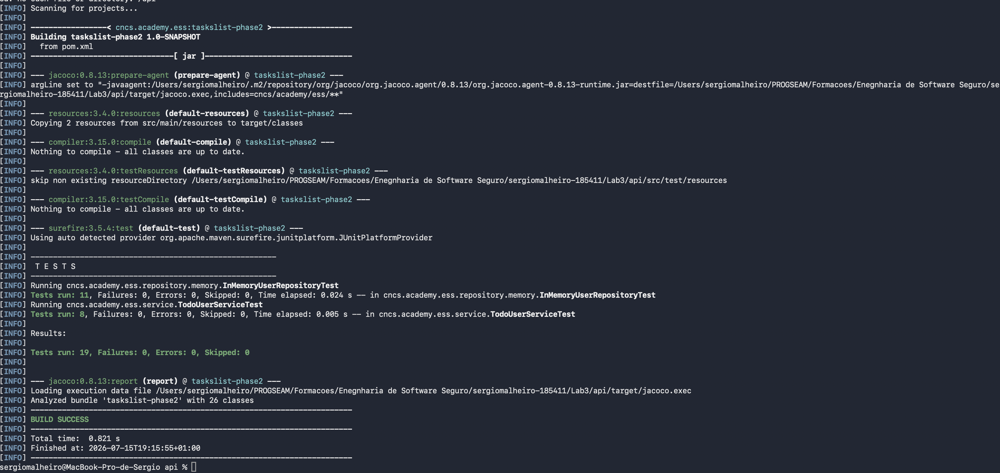

### 3.5. b) Cobertura de testes

A cobertura é gerada automaticamente pelo JaCoCo em `target/site/jacoco/index.html`.

| Classe | Instruções | Linhas | Cobertura de linhas |
|--------|-----------|--------|---------------------|
| `InMemoryUserRepository` | 100 % | 16 / 16 | **100 %** |
| `TodoUserService` | 100 % | 18 / 18 | **100 %** |

**Análise:** a cobertura de 100 % nas classes-alvo confirma que todos os caminhos relevantes
são exercitados — incluindo os ramos condicionais: em `save`, o caso `id == 0` (gerar id) e
`id != 0` (preservar); em `login` e `findByUsername`, os caminhos "encontrado" e "não
encontrado"; e em `login`, password correta vs. incorreta. As restantes classes do projeto
(controladores, repositórios SQL) não são alvo destes testes unitários e por isso aparecem com
cobertura inferior no relatório global — o que é esperado.

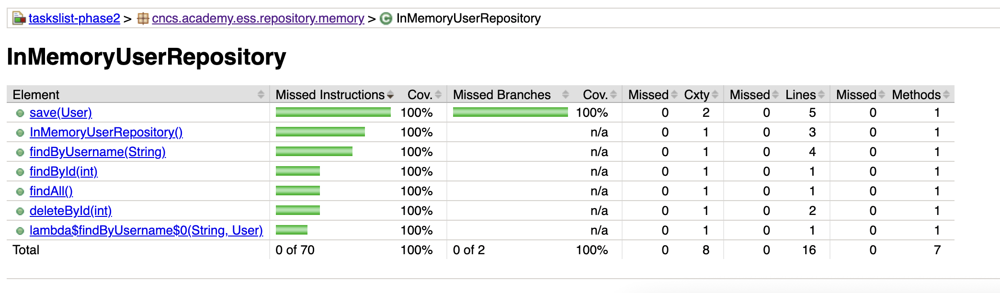

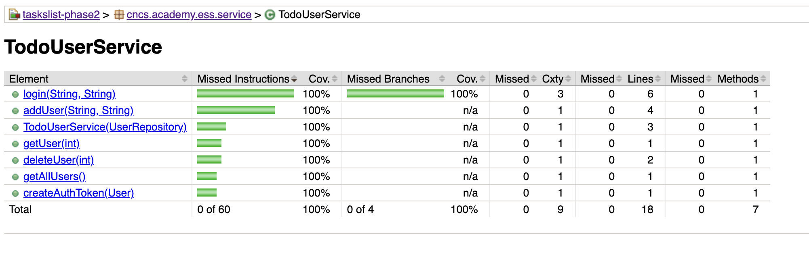

---

## 4. Parte 2 — Testes de integração

### 4.1. Coleção Postman

A coleção fornecida no enunciado (`TodoList-phase1.original.json`, mantida no repositório para
referência) apresentava três problemas que impediam a execução automática:

1. As rotas dos itens estavam dessincronizadas da API (`/todolist/item` em vez de `/todo/item`);
2. Usava `localhost`, que dentro do contentor Newman refere o próprio contentor;
3. Não capturava o token de autenticação para reutilização.

Foi por isso criada uma coleção corrigida e estendida, `postman.json`, que:

- Usa `host.docker.internal:7100` (o anfitrião visto de dentro do contentor);
- **Captura o token** com `pm.response.text()` — o `/login` devolve a string `Bearer <username>`
  em cru (não é JSON), guardada na variável de coleção `userToken` e reutilizada no header
  `Authorization` dos pedidos seguintes;
- Contém **asserções** (`pm.test`) em cada pedido (código de estado e conteúdo);
- Cobre o fluxo completo, incluindo a funcionalidade nova de marcar-completo.

**Fluxo (11 pedidos):** criar utilizador → login → obter utilizador → criar lista → criar item
→ listar itens → **marcar item completo** → confirmar completo → pedido sem token (401) →
apagar item → apagar utilizador.

### 4.2. a) Repositório em memória

```bash
# Terminal 1 — API em memória
cd api && REPO=memory mvn exec:java

# Terminal 2 — Newman via Docker
cd testes-integracao
docker run --rm -v "${PWD}":/etc/newman -t postman/newman run postman.json
```

**Resultado: 11 pedidos, 19 asserções, 0 falhas.**

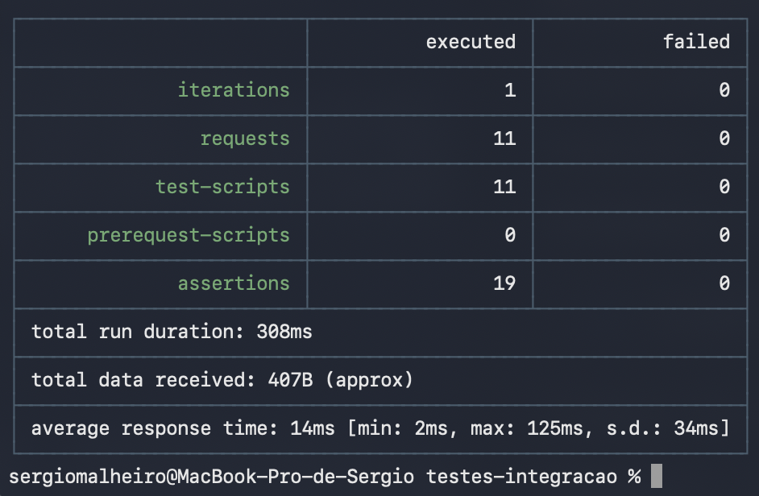

### 4.3. b) Repositório SQL (PostgreSQL)

Para o modo SQL usa-se um PostgreSQL em Docker (`docker-compose.yml`), cujo esquema
(`initdb/01-schema.sql`) é aplicado automaticamente no primeiro arranque. O esquema inclui
`ON DELETE CASCADE` nas chaves estrangeiras, para que o último passo (apagar o utilizador)
respeite as tabelas dependentes (listas e itens).

```bash
# Terminal 2 — arrancar o PostgreSQL
cd testes-integracao && docker compose up -d

# Terminal 1 — API em modo SQL
cd api && REPO=sql mvn exec:java

# Terminal 2 — a mesma coleção
docker run --rm -v "${PWD}":/etc/newman -t postman/newman run postman.json

# Limpeza
docker compose down -v
```

**Resultado: idêntico — 11 pedidos, 19 asserções, 0 falhas**, agora persistindo em PostgreSQL.
O facto de a mesma coleção passar sem alterações nos dois backends demonstra que a camada de
repositório está corretamente abstraída.

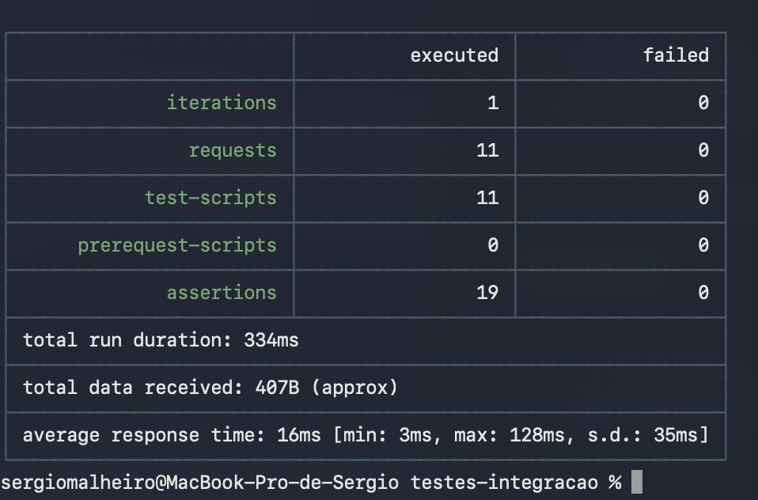

---

## 5. Parte 3 — Aplicação cliente multiplataforma

### 5.0. Relação com o código exemplo fornecido (`todoapp-flutter`)

O código exemplo fornecido (`todoapp-flutter/`, incluído no repositório para referência) foi
analisado: consome os mesmos endpoints (`/login`, `/todolist`, `/todo/{listId}/tasks`) e o mesmo
modelo de dados (`id`, `listId`, `description`, `completed`), mas é apenas de leitura (login e
listagem) e traz somente os targets Android/iOS. A aplicação `todoapp/` apresentada neste
relatório foi **desenhada e escrita de raiz** (alínea c), mantendo total compatibilidade com o
contrato da API do exemplo, e **estende-o** com: criação de listas e tarefas, eliminação,
**marcar tarefas como completas** (alínea b), campo de servidor configurável no login e
targets Desktop (macOS), iOS e Android.

### 5.0.1. Compilação e execução da aplicação base fornecida

Conforme pedido no enunciado ("garanta que consegue compilar o código e executar a aplicação
base"), o projeto `todoapp-flutter/` foi compilado e executado no emulador Android. A
compilação falhava inicialmente com o toolchain atual, tendo sido necessário diagnosticar e
resolver três incompatibilidades de versões — um exercício útil de gestão de dependências:

| Erro observado | Causa | Correção aplicada |
|----------------|-------|-------------------|
| `Unsupported class file major version 65` | Gradle 7.6.3 não suporta Java 21 (o JDK que acompanha o Android Studio) | Gradle wrapper 7.6.3 → **8.9** |
| `Your project's Gradle version is lower than Flutter's minimum supported version of 8.7.0` | O Flutter atual exige Gradle ≥ 8.7 | confirmada a versão 8.9; AGP 7.3.0 → **8.6.0**, Kotlin 1.7.10 → **1.9.0** |
| `Inconsistent JVM-target compatibility ... (1.8) and (21)` | `compileOptions` em Java 8 mas Kotlin a compilar para 21 | `sourceCompatibility`/`targetCompatibility` → **17** e `kotlinOptions.jvmTarget` → **17** |

Após estas alterações a compilação conclui com sucesso
(`✓ Built build/app/outputs/flutter-apk/app-debug.apk`).

**Defeito funcional encontrado (duplicação do prefixo `Bearer`).** Depois de compilar, a
aplicação autenticava mas apresentava a lista vazia. A análise dos registos do servidor revelou
a causa exata:

```
AuthorizationMiddleware - Authorization token is invalid Bearer user1
```

O `TodoUserService.login` da API devolve o token **já com o prefixo** (`"Bearer user1"`), mas o
cliente compunha o cabeçalho como `'Bearer $token'`, enviando `Authorization: Bearer Bearer
user1`. O middleware remove os primeiros 7 caracteres (`"Bearer "`) e procura o utilizador
`"Bearer user1"`, que não existe — daí o 401 e a lista vazia. A correção foi enviar o token tal
como a API o devolve (`lib/services/todo_service.dart`):

```dart
// antes:  HttpHeaders.authorizationHeader: 'Bearer $token',
// depois: HttpHeaders.authorizationHeader: token,
```

Este caso ilustra bem a importância de um **contrato de API explícito**: como o token já
transporta o esquema de autenticação, a responsabilidade de o prefixar não pode estar também do
lado do cliente. Na aplicação desenvolvida por nós esta ambiguidade foi evitada desde o início,
tratando o valor devolvido pelo `/login` como opaco e enviando-o sem transformação.

Com esta correção a aplicação base executa corretamente no emulador, autenticando e listando as
listas e tarefas obtidas da API (o `.env` do projeto já aponta para `10.0.2.2:7100`, o alias do
anfitrião visto do emulador).

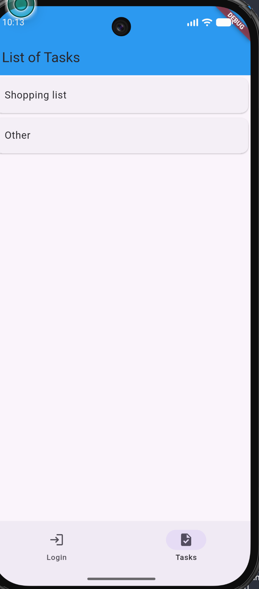


### 5.1. Arquitetura do cliente (Flutter)

O cliente `todoapp/` está organizado em:

| Ficheiro | Responsabilidade |
|----------|------------------|
| `lib/models.dart` | Modelos `TodoList` e `Todo` (desserialização do JSON da API) |
| `lib/api_client.dart` | Cliente HTTP: `login`, `getLists`, `createList`, `getTodos`, `createTodo`, `setCompleted`, `deleteTodo` |
| `lib/main.dart` | Interface: ecrãs de Login → Listas → Tarefas |

O endereço da API adapta-se à plataforma: `http://localhost:7100` no Desktop,
`http://10.0.2.2:7100` no emulador Android, e o **IP do anfitrião na rede local** num
dispositivo físico (campo "Servidor" editável no ecrã de login). O token `Bearer <username>`
devolvido pelo login é enviado tal e qual no header `Authorization`.

### 5.2. a) Execução em Desktop e em dispositivo móvel

Preparação (uma vez): `flutter pub get` e `flutter create --platforms=android,ios,macos .`.
Execução: `flutter run -d macos` (Desktop) ou `flutter run -d <dispositivo>` (móvel).

A aplicação foi testada nas **três** plataformas a partir da mesma base de código:

| Plataforma | Ambiente | Endereço da API |
|------------|----------|-----------------|
| **Desktop** | macOS (target `macos`) | `http://localhost:7100` (automático) |
| **Android** | Emulador Pixel 9, Android 16 (API 36), arm64 | `http://10.0.2.2:7100` (automático) |
| **iOS** *(extra)* | iPhone físico, assinado via Xcode | `http://192.168.1.64:7100` (IP do Mac na rede local) |

No **Android**, o emulador foi criado no Android Studio (*Device Manager*) e a aplicação
instalada com `flutter run -d emulator-5554`; o endereço `10.0.2.2` é resolvido
automaticamente pela aplicação, por ser o alias do anfitrião visto de dentro do emulador.

Como demonstração adicional de portabilidade, a mesma base de código foi ainda executada num
**iPhone físico**, ligado por cabo e assinado via Xcode (*Automatically manage signing*), com
o campo "Servidor" apontado ao IP do Mac na rede local (ambos na mesma rede Wi-Fi).

#### Detalhes técnicos do deployment no iPhone (via Xcode)

Ao contrário do Android (que empacota a aplicação num **APK**), no iOS a aplicação é compilada
num *bundle* **`.app` assinado** (distribuível como `.ipa`) e só pode ser instalada num
dispositivo físico depois de assinada com um certificado de programador. O processo seguido:

1. `flutter create --platforms=ios .` — gera o projeto Xcode (`ios/Runner.xcworkspace`);
   as dependências nativas são geridas pelo **CocoaPods**;
2. No iPhone, ativou-se o **Developer Mode** (Definições → Privacidade e Segurança) e ligou-se
   o dispositivo por cabo ao Mac;
3. No **Xcode** (target *Runner* → *Signing & Capabilities*): ativou-se
   *Automatically manage signing* com a equipa pessoal associada ao Apple ID — o Xcode gera
   automaticamente o certificado de *development* e o *provisioning profile* que autorizam a
   instalação neste dispositivo (com conta gratuita, o perfil é válido por 7 dias);
4. `flutter run -d <iPhone>` — compila via `xcodebuild`, assina o `.app`, instala-o pelo cabo
   e lança a aplicação; na primeira execução foi necessário confiar no certificado no iPhone
   (Definições → Geral → VPN e Gestão de Dispositivos);
5. Como o dispositivo físico não vê o `localhost` do Mac, o campo "Servidor" do ecrã de login
   foi apontado ao IP do anfitrião na rede local (`http://192.168.1.64:7100`), com o Mac e o
   iPhone na mesma rede Wi-Fi (a API Javalin escuta em `0.0.0.0`, pelo que aceita ligações de
   qualquer interface sem reconfiguração).

**Notas de configuração encontradas e resolvidas:**
- **macOS:** a aplicação corre em *sandbox* e bloqueia ligações de saída por omissão. Foi
  adicionada a *entitlement* `com.apple.security.network.client` em
  `macos/Runner/DebugProfile.entitlements` e `Release.entitlements`.
- **iOS:** o iOS bloqueia HTTP em claro (*App Transport Security*); foi adicionado
  `NSAllowsArbitraryLoads` ao `ios/Runner/Info.plist` (apenas para testes locais).
- **Android:** como a API de teste é HTTP (não HTTPS), é necessário
  `android:usesCleartextTraffic="true"` no `AndroidManifest.xml` (já aplicado); a geração do
  APK correspondente faz-se com `flutter build apk --release`, exigindo o Android SDK.

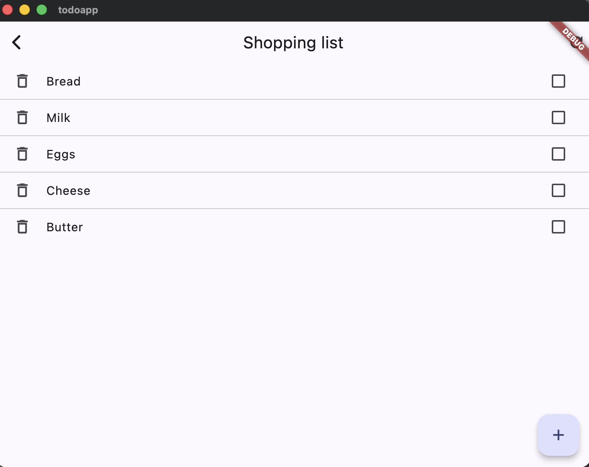

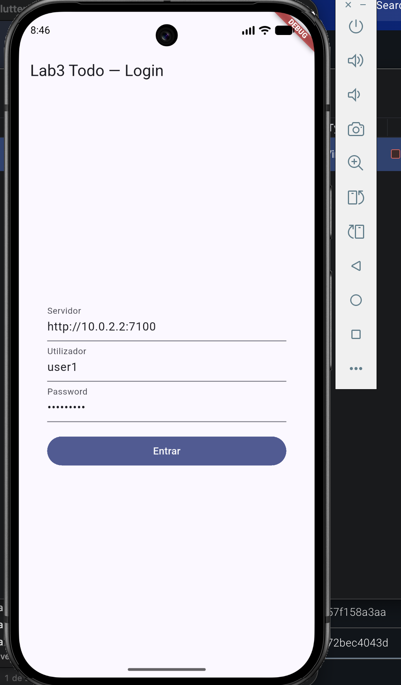

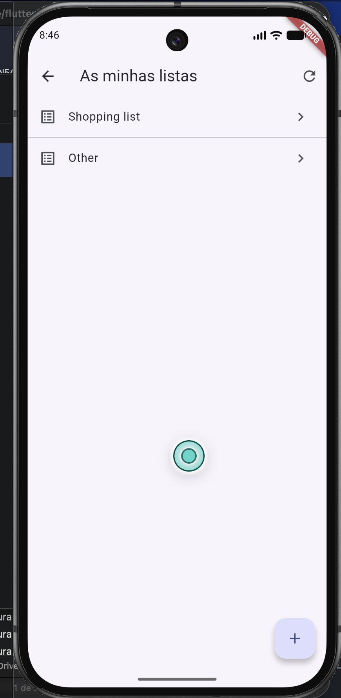

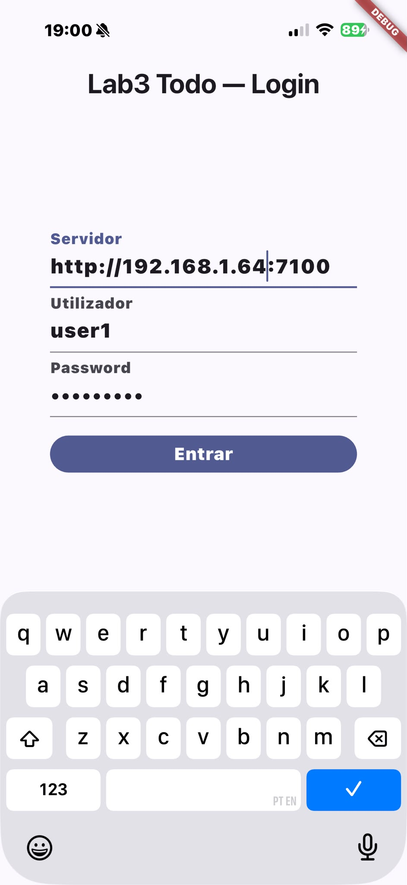

### 5.3. b) Marcar tarefas como completas (API + cliente)

A funcionalidade foi implementada em toda a stack:

- **API:** novos endpoints `PUT /todo/{listId}/tasks/{taskId}/complete` e `/incomplete`. O
  `TodoController` verifica a posse da lista, e o `TodoService.setCompleted(...)` altera o campo
  `completed` do item e persiste-o via `TodoRepository.update(...)` (implementado tanto no
  repositório em memória como no SQL).
- **Cliente:** cada tarefa é apresentada com uma *checkbox* (`CheckboxListTile`); ao alterá-la,
  o `ApiClient.setCompleted(...)` é chamado e a lista é recarregada, mostrando o item riscado
  quando completo.

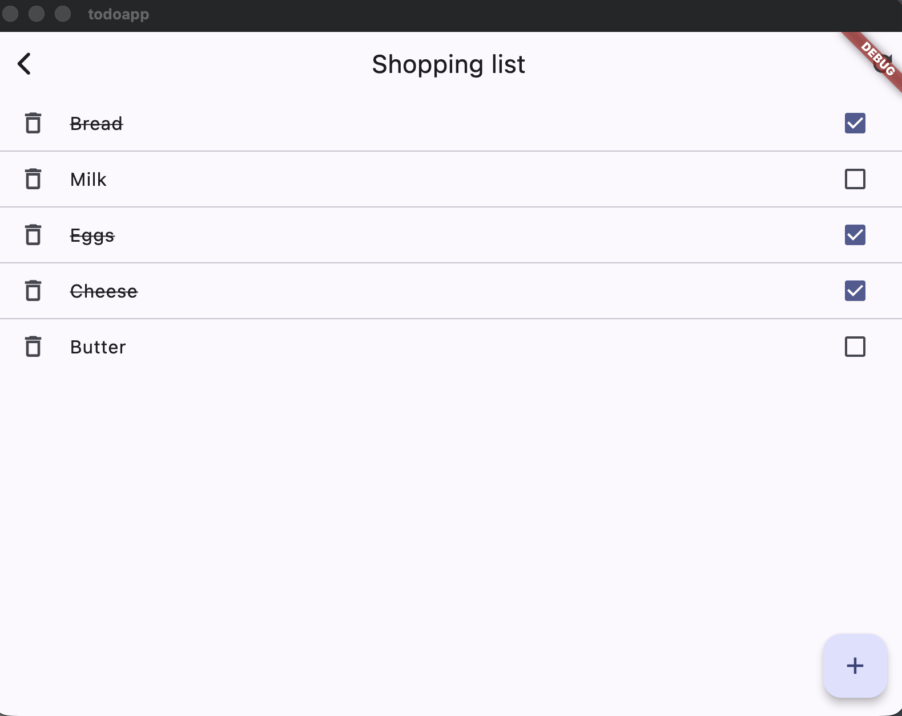

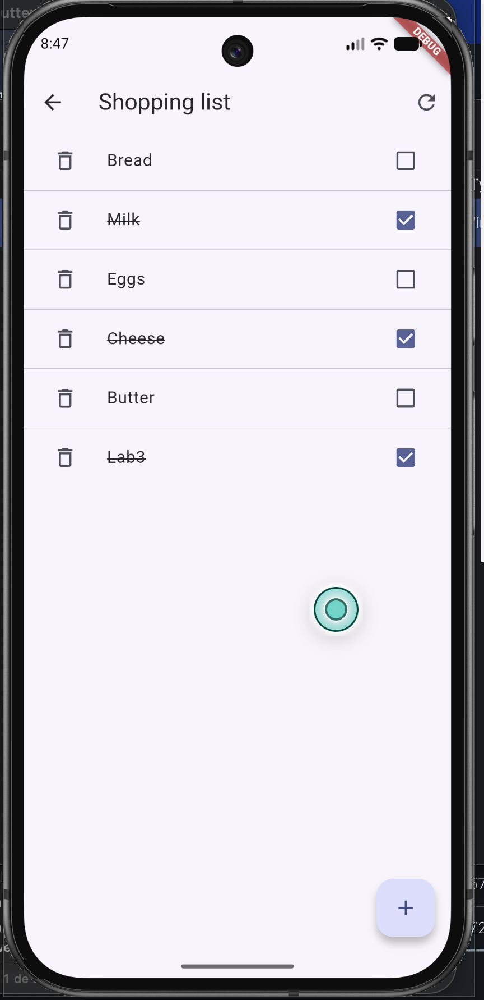

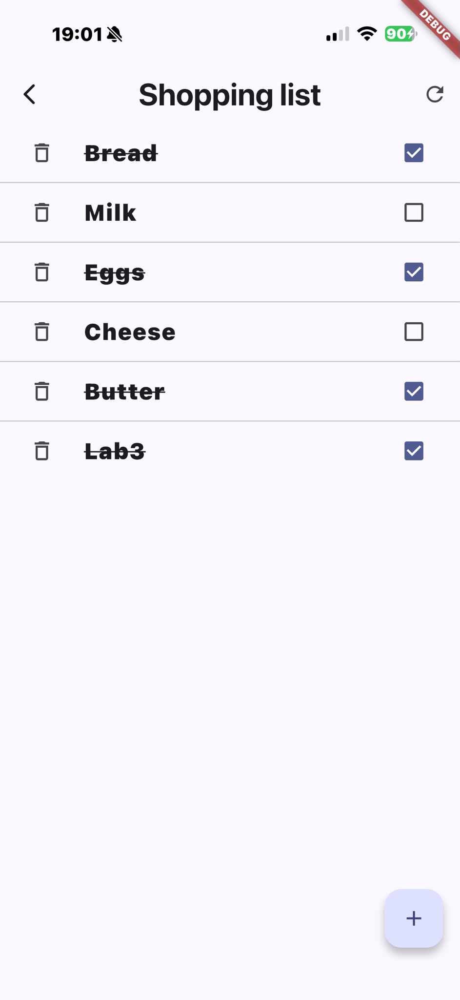

A funcionalidade foi validada nas três plataformas, com a alteração a ser persistida no
servidor (o estado mantém-se após recarregar a lista, confirmando a chamada `PUT` à API).

### 5.4. c) Aplicação Flutter própria — Engenharia de Software utilizada

A aplicação `todoapp/` foi desenhada e escrita de raiz para este laboratório, aplicando as
práticas de engenharia de software trabalhadas nas sessões:

**Levantamento de requisitos.** Os requisitos funcionais foram derivados do contrato da API
(endpoints e DTOs dos labs 1/2) e do enunciado: autenticar, listar as listas do utilizador,
navegar para os itens, criar, eliminar e marcar como completo. Requisitos não-funcionais:
multiplataforma (Desktop/mobile a partir de uma única base de código), tolerância a falhas de
rede (mensagens de erro claras) e configuração do servidor sem recompilar.

**Arquitetura em camadas.** O código está separado por responsabilidade única:

| Camada | Ficheiro | Papel |
|--------|----------|-------|
| Modelo | `models.dart` | DTOs imutáveis (`TodoList`, `Todo`) com `fromJson` — fronteira única de desserialização |
| Serviço | `api_client.dart` | Todo o HTTP num só sítio; guarda o token e injeta-o no header `Authorization`; converte respostas em modelos ou exceções |
| Apresentação | `main.dart` | Três ecrãs (Login → Listas → Tarefas); nenhuma chamada HTTP direta na UI |

Esta separação (padrão *service/repository* no cliente) permite trocar a API ou testar as
camadas isoladamente — a mesma disciplina usada no back-end (controller → service → repository).

**Padrões e técnicas aplicados:**
- **Estado assíncrono declarativo:** `FutureBuilder` para os três estados (a carregar / erro /
  dados), evitando gestão manual de estado;
- **Injeção de dependência simples:** o `ApiClient` autenticado é passado aos ecrãs por
  construtor — não há singletons globais;
- **Configuração por plataforma:** o endereço por omissão adapta-se em runtime
  (`localhost` no Desktop, `10.0.2.2` no emulador Android) e é editável no ecrã de login para
  dispositivos físicos — sem *rebuild*;
- **Tratamento de erros:** códigos HTTP inesperados geram exceções com contexto, apresentadas
  ao utilizador; o login distingue credenciais inválidas de falhas de rede.

**Considerações de segurança.** O token vive apenas em memória (não é persistido em disco),
reduzindo a exposição em caso de perda do dispositivo; as exceções ao bloqueio de HTTP em claro
(ATS no iOS, `usesCleartextTraffic` no Android, *entitlement* no macOS) estão documentadas como
medidas exclusivas de ambiente de teste — em produção usar-se-ia HTTPS.

**Processo.** Desenvolvimento iterativo e incremental com controlo de versões (git, commits
pequenos e descritivos): primeiro o fluxo mínimo (login + listagem), depois as operações de
escrita, por fim a funcionalidade de marcar-completo em toda a stack; cada iteração foi
validada manualmente contra a API real em três plataformas (macOS, iPhone físico e, no
desenvolvimento, Chrome), tendo os defeitos encontrados (sandbox do macOS, ATS do iOS,
`setState` com `Future`) sido corrigidos e documentados neste relatório.

---

## 6. Conclusão

Todos os objetivos do laboratório foram cumpridos:

- **Parte 1:** 19 testes unitários JUnit5 para `InMemoryUserRepository` e `TodoUserService`,
  com **100 % de cobertura de linhas** em ambas as classes.
- **Parte 2:** coleção Postman executada com Newman, com **19 asserções sem falhas** tanto no
  repositório em memória como em PostgreSQL.
- **Parte 3:** cliente Flutter a correr em **Desktop (macOS)** e **Android** (emulador Pixel 9,
  API 36) — e ainda, como extra, num **iPhone físico** — estendido com a funcionalidade de
  marcar tarefas como completas (API + cliente), demonstrada em todas as plataformas.
- **Parte 3c:** aplicação Flutter desenhada e escrita de raiz (compatível e mais completa que o
  exemplo fornecido), acompanhada do relatório da engenharia de software utilizada no seu
  desenvolvimento (secção 5.4).

O código, a coleção de testes e o cliente estão no repositório GitHub indicado no topo.
